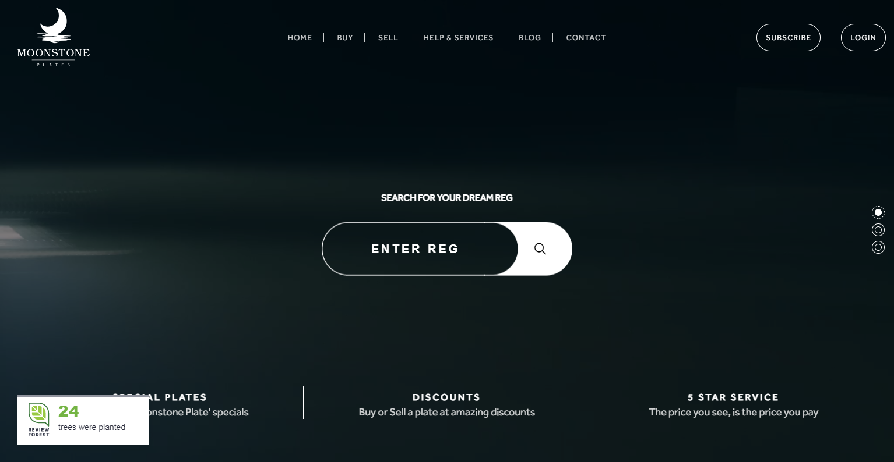
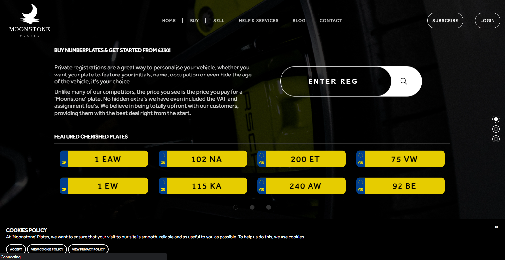
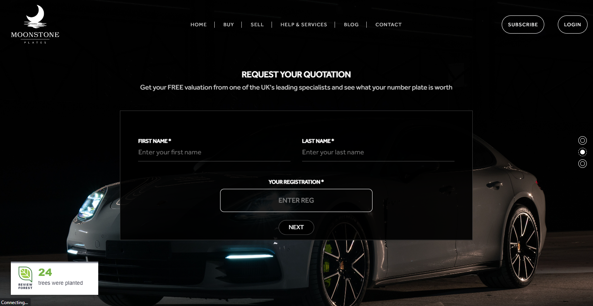
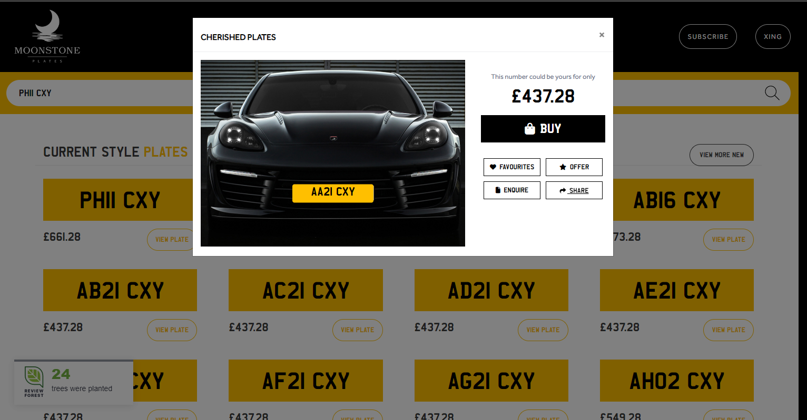

# Moonstone

> Car Ecommerce Project.

## Table of Contents

- [General Info](#general-information)
- [Technologies Used](#technologies-used)
- [Features](#features)
- [Screenshots](#screenshots)
- [Setup](#setup)
- [Usage](#usage)
- [Project Status](#project-status)
- [Room for Improvement](#room-for-improvement)
- [Acknowledgements](#acknowledgements)
- [Contact](#contact)

## General Information

- Car Trading Site
- The reason I took this project is I wanted to develop Ecommerce Site.

## Technologies Used

- CodeIgniter
- JQuery
- CSS

## Features

- Detailed Car Information
- Awesome Car Pics
- FAQ Support

## Screenshots

## Setup

This is CodeIgniter 3 based project. All you need to do is copy vendor directory.

Just run `composer update` command.
Edit document root directory in Apache or copy the whole project to Xampp/htdocs.

## Usage

You can use this site for car trading actions.

## Project Status

Project is: _in progress_.

## Room for Improvement

These are room for improvement & ToDos.

Room for improvement:

- CodeIgniter 3
- UI Design
- Shpoify

To do:

- Flexible UI
- Validation

## Acknowledgements

- This project was inspired by NINI.
- Many thanks to NINI.

## Contact

Created by [@violetstar701](https://) - feel free to contact me!
